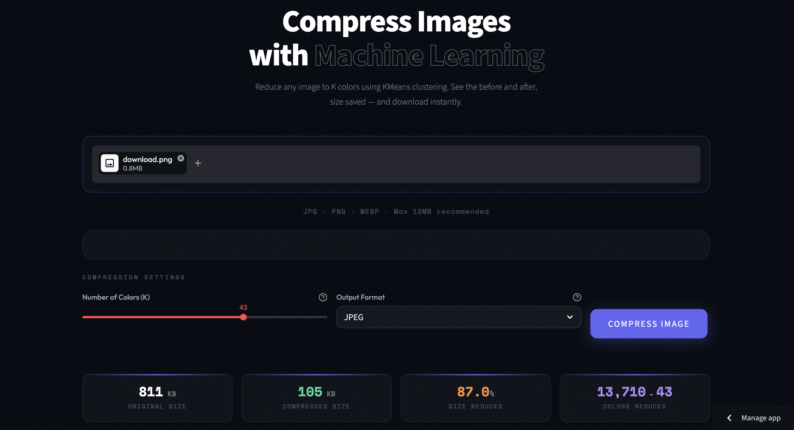

# Image Compression Using KMeans Clustering

Compresses any image by reducing it to K dominant colors using KMeans clustering Deployed as a live web app where you upload an image, choose how many colors to keep, and download the compressed version instantly

**Live Demo:** https://image-compresor-using-kmeans.streamlit.app/

---



---

## Problem Statement

A standard image can contain hundreds of thousands of unique colors. Most of those colors are unnecessary for the image to look recognizable
This project uses KMeans clustering to group all pixel colors into K clusters and replace every pixel with its nearest cluster center 
dramatically reducing file size while keeping visual quality intact.

## How It Works

This is not a deep learning model. It is unsupervised machine learning applied directly to pixel data.

| Step | What Happens |
|---|---|
| Upload | Image is read and converted to a NumPy array of shape (H, W, 3) |
| Reshape | Array is flattened to (H x W, 3) — each row is one pixel's RGB value |
| KMeans Fit | KMeans clusters all pixels into K groups based on color similarity |
| Replace | Every pixel is replaced with its cluster center's RGB value |
| Rebuild | Array is reshaped back to original dimensions and saved as image |

---

## Results — Tested on a Real Image

| Metric | Value |
|---|---|
| Original File Size | 8,273 KB |
| Compressed File Size | 2,007 KB |
| Size Reduction | 75.7% |
| Original Unique Colors | 245,898 |
| Compressed Colors (K=16) | 16 |
| Color Reduction | 99.99% |

The model reduced a 8 MB image to under 2 MB using just 16 colors — no quality settings, no deep learning just math

---

## Features

- Upload any JPG, PNG, or WEBP image
- Choose K colors between 2 and 64 using a slider
- See before and after images side by side
- view exact file size reduction in KB and percentage
- Download compressed image in JPEG, PNG, or WEBP format

---

## Tech Stack

`Python` `NumPy` `Pillow` `Scikit-learn` `Streamlit`

---

## Project Structure

```
image-compression/
├── app.py                      # UI + Model 
├── requirements.txt
└── README.md
```

---

## Key Learning

Most machine learning projects I had done before this involved supervised learning — labeled data, train/test splits, accuracy scores
This project was different 
KMeans is unsupervised. there is no correct answer to optimize for The model just finds structure in the data on its own

What surprised me was how well it works Reducing 245,898 colors to just 16 and still having a recognizable image made me understand what clustering actually does -> it finds what is essential and throws away the rest

---

## Connect

- GitHub: https://github.com/sourabh9098
- LinkedIn: www.linkedin.com/in/sourabh9098

---

*Unsupervised learning. No labels. No training data. Just math on pixels.*
